# 🗄️ Database Schema - MOOV

## Entity-Relationship Diagram

```mermaid
erDiagram
    Users ||--o{ Exercises : creates
    Users ||--o{ Programs : creates
    Users ||--o{ Routines : creates
    Users ||--o{ Workouts : completes
    Users ||--o{ Body_Weight_Records : tracks
    Users ||--o{ Body_Check_Photos : uploads
    Users ||--o{ Messages : sends
    Users ||--o{ Messages : receives
    Users ||--o{ Subscriptions : has
    Users ||--o{ Coach_Questionnaires : creates
    Users ||--o{ Questionnaire_Answers : submits
    Users ||--o{ Calendar_Reminders : creates
    Users ||--o{ Coach_Availability : sets

    Users ||--o{ Coach_Clients : "is coach"
    Users ||--o{ Coach_Clients : "is client"
    Users ||--o{ Appointments : "coaches"
    Users ||--o{ Appointments : "attends"
    Users ||--o{ Macronutrients : "receives (client)"
    Users ||--o{ Macronutrients : "assigns (coach)"

    Programs ||--o{ Routines : contains
    Programs ||--o{ Programs : "assigned_to (client)"

    Routines ||--o{ Routine_Exercises : includes
    Routines ||--o{ Workouts : "used in"
    Routines ||--o{ Routines : "assigned_to (client)"

    Exercises ||--o{ Routine_Exercises : "part of"
    Exercises ||--o{ Workout_Sets : "performed in"

    Workouts ||--o{ Workout_Sets : contains

    Coach_Questionnaires ||--o{ Questionnaire_Questions : has
    Questionnaire_Questions ||--o{ Questionnaire_Answers : "answered by"

    Users {
        UUID id PK
        VARCHAR email UK
        VARCHAR password_hash
        VARCHAR name
        VARCHAR profile_picture
        ENUM role
        ENUM subscription_status
        TIMESTAMP subscription_end_date
        TIMESTAMP created_at
        TIMESTAMP updated_at
    }

    Exercises {
        UUID id PK
        UUID user_id FK
        VARCHAR name
        ENUM type
        BOOLEAN is_unilateral
        TEXT notes
        BOOLEAN is_template
        TIMESTAMP created_at
    }

    Programs {
        UUID id PK
        UUID user_id FK
        UUID assigned_to FK
        VARCHAR name
        TEXT description
        BOOLEAN is_archived
        TIMESTAMP created_at
        TIMESTAMP updated_at
    }

    Routines {
        UUID id PK
        UUID program_id FK
        UUID user_id FK
        UUID assigned_to FK
        VARCHAR name
        TEXT description
        BOOLEAN is_archived
        TIMESTAMP created_at
        TIMESTAMP updated_at
    }

    Routine_Exercises {
        UUID id PK
        UUID routine_id FK
        UUID exercise_id FK
        INTEGER order
        INTEGER target_sets
        INTEGER target_reps_min
        INTEGER target_reps_max
        INTEGER rest_time_seconds
    }

    Workouts {
        UUID id PK
        UUID user_id FK
        UUID routine_id FK
        TIMESTAMP started_at
        TIMESTAMP completed_at
        INTEGER duration_minutes
        TEXT notes
    }

    Workout_Sets {
        UUID id PK
        UUID workout_id FK
        UUID exercise_id FK
        INTEGER set_number
        DECIMAL weight_kg
        INTEGER reps
        INTEGER rpe
        VARCHAR video_url
        TIMESTAMP completed_at
    }

    Body_Weight_Records {
        UUID id PK
        UUID user_id FK
        DECIMAL weight_kg
        TIMESTAMP recorded_at
        TEXT notes
    }

    Body_Check_Photos {
        UUID id PK
        UUID user_id FK
        VARCHAR photo_url
        TIMESTAMP recorded_at
        TEXT notes
    }

    Coach_Clients {
        UUID id PK
        UUID coach_id FK
        UUID client_id FK
        ENUM status
        TIMESTAMP joined_at
    }

    Messages {
        UUID id PK
        UUID sender_id FK
        UUID receiver_id FK
        TEXT message
        VARCHAR attachment_url
        TIMESTAMP read_at
        TIMESTAMP created_at
    }

    Appointments {
        UUID id PK
        UUID coach_id FK
        UUID client_id FK
        TIMESTAMP scheduled_at
        INTEGER duration_minutes
        ENUM type
        ENUM status
        VARCHAR location
        TEXT notes
        TIMESTAMP created_at
    }

    Coach_Availability {
        UUID id PK
        UUID coach_id FK
        INTEGER day_of_week
        TIME start_time
        TIME end_time
        INTEGER slot_duration_minutes
        BOOLEAN is_active
    }

    Subscriptions {
        UUID id PK
        UUID user_id FK
        VARCHAR stripe_customer_id
        VARCHAR stripe_subscription_id
        ENUM plan_type
        ENUM status
        TIMESTAMP current_period_start
        TIMESTAMP current_period_end
        TIMESTAMP created_at
    }

    Macronutrients {
        UUID id PK
        UUID client_id FK
        UUID coach_id FK
        INTEGER protein_g
        INTEGER carbs_g
        INTEGER fats_g
        INTEGER calories
        TEXT notes
        TIMESTAMP valid_from
        TIMESTAMP valid_to
        TIMESTAMP created_at
    }

    Coach_Questionnaires {
        UUID id PK
        UUID coach_id FK
        BOOLEAN is_default
        TIMESTAMP created_at
        TIMESTAMP updated_at
    }

    Questionnaire_Questions {
        UUID id PK
        UUID questionnaire_id FK
        TEXT question_text
        ENUM question_type
        INTEGER order
        BOOLEAN is_required
        TIMESTAMP created_at
    }

    Questionnaire_Answers {
        UUID id PK
        UUID question_id FK
        UUID client_id FK
        TEXT answer_text
        TIMESTAMP answered_at
    }

    Calendar_Reminders {
        UUID id PK
        UUID coach_id FK
        UUID client_id FK
        VARCHAR title
        TEXT description
        TIMESTAMP reminder_date
        BOOLEAN is_completed
        TIMESTAMP created_at
    }
```



---

## 📋 Tabelle per Categoria

### 🔐 Autenticazione & Utenti
- **Users**: utenti (FREE o COACH)
- **Subscriptions**: abbonamenti Stripe

### 💪 Allenamento Core
- **Exercises**: esercizi custom creati dagli utenti
- **Programs**: schede (insieme di routine)
- **Routines**: singole routine di allenamento
- **Routine_Exercises**: join table routine-esercizi con configurazione
- **Workouts**: allenamenti completati
- **Workout_Sets**: serie completate durante allenamento

### 📊 Tracciamento Progressi
- **Body_Weight_Records**: peso corporeo nel tempo
- **Body_Check_Photos**: foto check fisico

### 👥 Sistema Coach-Cliente
- **Coach_Clients**: relazione coach-cliente
- **Macronutrients**: macronutrienti assegnati ai clienti
- **Coach_Questionnaires**: questionari creati dai coach
- **Questionnaire_Questions**: domande dei questionari
- **Questionnaire_Answers**: risposte dei clienti

### 💬 Comunicazione
- **Messages**: chat 1-to-1 coach-cliente

### 📅 Calendario
- **Appointments**: sedute programmate
- **Coach_Availability**: disponibilità coach
- **Calendar_Reminders**: reminder personalizzati coach

---

## 🔑 Relazioni Chiave

### User → Exercise (1:N)
Un utente crea molti esercizi custom.

### Program → Routine (1:N)
Una scheda contiene multiple routine (es. PPL: Push, Pull, Legs).

### Routine → Routine_Exercises → Exercise (N:N)
Una routine include molti esercizi, ogni esercizio può essere in più routine.
Join table contiene configurazione (serie, reps, riposo).

### User → Workout → Workout_Sets → Exercise (1:N:N)
Un utente completa molti allenamenti, ogni allenamento ha molte serie, ogni serie riferisce un esercizio.

### Coach → Client (N:N via Coach_Clients)
Un coach ha molti clienti, un cliente ha un coach (o nessuno).

### Coach → Client → Macronutrients (1:N:N)
Un coach assegna macronutrienti a un cliente, con storico nel tempo (valid_from, valid_to).

### Coach → Questionnaire → Questions → Answers ← Client (1:N:N:N)
Un coach crea questionari con domande, i clienti rispondono durante onboarding.

### Coach ↔ Client → Appointments (N:N)
Coach e clienti prenotano sedute.

### User → Messages ← User (N:N self-referencing)
Utenti si scambiano messaggi (sender/receiver).

---

## 📐 Indici Raccomandati

### Performance-Critical Indexes

```sql
-- Users
CREATE INDEX idx_users_email ON Users(email);
CREATE INDEX idx_users_role ON Users(role);

-- Exercises
CREATE INDEX idx_exercises_user_id ON Exercises(user_id);
CREATE INDEX idx_exercises_name ON Exercises(name);

-- Programs
CREATE INDEX idx_programs_user_id ON Programs(user_id);
CREATE INDEX idx_programs_assigned_to ON Programs(assigned_to);
CREATE INDEX idx_programs_is_archived ON Programs(is_archived);

-- Routines
CREATE INDEX idx_routines_program_id ON Routines(program_id);
CREATE INDEX idx_routines_user_id ON Routines(user_id);
CREATE INDEX idx_routines_assigned_to ON Routines(assigned_to);
CREATE INDEX idx_routines_is_archived ON Routines(is_archived);

-- Routine_Exercises
CREATE INDEX idx_routine_exercises_routine_id ON Routine_Exercises(routine_id);
CREATE INDEX idx_routine_exercises_exercise_id ON Routine_Exercises(exercise_id);

-- Workouts
CREATE INDEX idx_workouts_user_id ON Workouts(user_id);
CREATE INDEX idx_workouts_routine_id ON Workouts(routine_id);
CREATE INDEX idx_workouts_completed_at ON Workouts(completed_at DESC);

-- Workout_Sets
CREATE INDEX idx_workout_sets_workout_id ON Workout_Sets(workout_id);
CREATE INDEX idx_workout_sets_exercise_id ON Workout_Sets(exercise_id);
CREATE INDEX idx_workout_sets_completed_at ON Workout_Sets(completed_at DESC);

-- Body_Weight_Records
CREATE INDEX idx_body_weight_user_id ON Body_Weight_Records(user_id);
CREATE INDEX idx_body_weight_recorded_at ON Body_Weight_Records(recorded_at DESC);

-- Body_Check_Photos
CREATE INDEX idx_body_check_photos_user_id ON Body_Check_Photos(user_id);
CREATE INDEX idx_body_check_photos_recorded_at ON Body_Check_Photos(recorded_at DESC);

-- Coach_Clients
CREATE INDEX idx_coach_clients_coach_id ON Coach_Clients(coach_id);
CREATE INDEX idx_coach_clients_client_id ON Coach_Clients(client_id);
CREATE INDEX idx_coach_clients_status ON Coach_Clients(status);

-- Messages
CREATE INDEX idx_messages_sender_id ON Messages(sender_id);
CREATE INDEX idx_messages_receiver_id ON Messages(receiver_id);
CREATE INDEX idx_messages_created_at ON Messages(created_at DESC);
CREATE INDEX idx_messages_conversation ON Messages(sender_id, receiver_id, created_at DESC);

-- Appointments
CREATE INDEX idx_appointments_coach_id ON Appointments(coach_id);
CREATE INDEX idx_appointments_client_id ON Appointments(client_id);
CREATE INDEX idx_appointments_scheduled_at ON Appointments(scheduled_at);
CREATE INDEX idx_appointments_status ON Appointments(status);

-- Coach_Availability
CREATE INDEX idx_coach_availability_coach_id ON Coach_Availability(coach_id);
CREATE INDEX idx_coach_availability_day_of_week ON Coach_Availability(day_of_week);

-- Subscriptions
CREATE INDEX idx_subscriptions_user_id ON Subscriptions(user_id);
CREATE INDEX idx_subscriptions_status ON Subscriptions(status);
CREATE INDEX idx_subscriptions_stripe_customer_id ON Subscriptions(stripe_customer_id);

-- Macronutrients
CREATE INDEX idx_macronutrients_client_id ON Macronutrients(client_id);
CREATE INDEX idx_macronutrients_coach_id ON Macronutrients(coach_id);
CREATE INDEX idx_macronutrients_valid_from ON Macronutrients(valid_from DESC);

-- Coach_Questionnaires
CREATE INDEX idx_coach_questionnaires_coach_id ON Coach_Questionnaires(coach_id);
CREATE INDEX idx_coach_questionnaires_is_default ON Coach_Questionnaires(is_default);

-- Questionnaire_Questions
CREATE INDEX idx_questionnaire_questions_questionnaire_id ON Questionnaire_Questions(questionnaire_id);

-- Questionnaire_Answers
CREATE INDEX idx_questionnaire_answers_question_id ON Questionnaire_Answers(question_id);
CREATE INDEX idx_questionnaire_answers_client_id ON Questionnaire_Answers(client_id);

-- Calendar_Reminders
CREATE INDEX idx_calendar_reminders_coach_id ON Calendar_Reminders(coach_id);
CREATE INDEX idx_calendar_reminders_client_id ON Calendar_Reminders(client_id);
CREATE INDEX idx_calendar_reminders_reminder_date ON Calendar_Reminders(reminder_date);
CREATE INDEX idx_calendar_reminders_is_completed ON Calendar_Reminders(is_completed);
```

---

## 🔒 Constraints & Validations

### Foreign Key Constraints
Tutte le relazioni FK devono avere `ON DELETE` policies:

```sql
-- Esempio: Workouts
ALTER TABLE Workouts
  ADD CONSTRAINT fk_workouts_user
  FOREIGN KEY (user_id) REFERENCES Users(id) ON DELETE CASCADE;

ALTER TABLE Workouts
  ADD CONSTRAINT fk_workouts_routine
  FOREIGN KEY (routine_id) REFERENCES Routines(id) ON DELETE SET NULL;

-- Coach_Clients: se coach o cliente vengono eliminati, rimuovi relazione
ALTER TABLE Coach_Clients
  ADD CONSTRAINT fk_coach_clients_coach
  FOREIGN KEY (coach_id) REFERENCES Users(id) ON DELETE CASCADE;

ALTER TABLE Coach_Clients
  ADD CONSTRAINT fk_coach_clients_client
  FOREIGN KEY (client_id) REFERENCES Users(id) ON DELETE CASCADE;

-- Messages: se sender o receiver eliminati, elimina messaggi
ALTER TABLE Messages
  ADD CONSTRAINT fk_messages_sender
  FOREIGN KEY (sender_id) REFERENCES Users(id) ON DELETE CASCADE;

ALTER TABLE Messages
  ADD CONSTRAINT fk_messages_receiver
  FOREIGN KEY (receiver_id) REFERENCES Users(id) ON DELETE CASCADE;
```

### Unique Constraints

```sql
-- Email univoca
ALTER TABLE Users ADD CONSTRAINT uk_users_email UNIQUE (email);

-- Un questionario di default per coach
CREATE UNIQUE INDEX uk_coach_questionnaires_default
  ON Coach_Questionnaires(coach_id)
  WHERE is_default = true;

-- Un cliente non può avere più coach contemporaneamente
CREATE UNIQUE INDEX uk_coach_clients_active
  ON Coach_Clients(client_id)
  WHERE status = 'active';
```

### Check Constraints

```sql
-- Peso deve essere positivo
ALTER TABLE Body_Weight_Records
  ADD CONSTRAINT chk_weight_positive CHECK (weight_kg > 0);

-- Macronutrienti devono essere positivi
ALTER TABLE Macronutrients
  ADD CONSTRAINT chk_macros_positive
  CHECK (protein_g >= 0 AND carbs_g >= 0 AND fats_g >= 0 AND calories >= 0);

-- Serie e ripetizioni devono essere > 0
ALTER TABLE Routine_Exercises
  ADD CONSTRAINT chk_sets_reps_positive
  CHECK (target_sets > 0 AND target_reps_min > 0 AND target_reps_max >= target_reps_min);

-- Peso sollevato e reps devono essere >= 0
ALTER TABLE Workout_Sets
  ADD CONSTRAINT chk_workout_sets_positive
  CHECK (weight_kg >= 0 AND reps > 0);

-- Durata slot disponibilità > 0
ALTER TABLE Coach_Availability
  ADD CONSTRAINT chk_slot_duration_positive
  CHECK (slot_duration_minutes > 0);

-- Day of week tra 0-6
ALTER TABLE Coach_Availability
  ADD CONSTRAINT chk_day_of_week_range
  CHECK (day_of_week BETWEEN 0 AND 6);
```

---

## 🧩 Query Comuni Ottimizzate

### 1. Ottenere peso usato nell'ultimo allenamento per un esercizio

```sql
SELECT
  ws.weight_kg,
  ws.reps,
  w.completed_at
FROM Workout_Sets ws
JOIN Workouts w ON ws.workout_id = w.id
WHERE ws.exercise_id = :exercise_id
  AND w.user_id = :user_id
  AND w.completed_at IS NOT NULL
ORDER BY w.completed_at DESC
LIMIT 1;
```

### 2. Progressi per esercizio (ultimi 3 mesi)

```sql
SELECT
  w.completed_at::date as workout_date,
  MAX(ws.weight_kg) as max_weight,
  AVG(ws.weight_kg) as avg_weight,
  SUM(ws.weight_kg * ws.reps) as total_volume
FROM Workout_Sets ws
JOIN Workouts w ON ws.workout_id = w.id
WHERE ws.exercise_id = :exercise_id
  AND w.user_id = :user_id
  AND w.completed_at >= NOW() - INTERVAL '3 months'
GROUP BY w.completed_at::date
ORDER BY workout_date ASC;
```

### 3. Lista clienti con ultimo allenamento e status

```sql
SELECT
  u.id,
  u.name,
  u.profile_picture,
  cc.status,
  MAX(w.completed_at) as last_workout,
  COUNT(w.id) as total_workouts,
  CASE
    WHEN MAX(w.completed_at) >= NOW() - INTERVAL '3 days' THEN 'green'
    WHEN MAX(w.completed_at) >= NOW() - INTERVAL '7 days' THEN 'yellow'
    ELSE 'red'
  END as activity_status
FROM Coach_Clients cc
JOIN Users u ON cc.client_id = u.id
LEFT JOIN Workouts w ON w.user_id = u.id
WHERE cc.coach_id = :coach_id
  AND cc.status = 'active'
GROUP BY u.id, u.name, u.profile_picture, cc.status
ORDER BY last_workout DESC NULLS LAST;
```

### 4. Macronutrienti attuali del cliente

```sql
SELECT
  protein_g,
  carbs_g,
  fats_g,
  calories,
  notes,
  valid_from
FROM Macronutrients
WHERE client_id = :client_id
  AND (valid_to IS NULL OR valid_to > NOW())
ORDER BY valid_from DESC
LIMIT 1;
```

### 5. Dati comparabili macro/peso (ultimo mese)

```sql
-- Peso corporeo
SELECT
  recorded_at::date as date,
  weight_kg
FROM Body_Weight_Records
WHERE user_id = :client_id
  AND recorded_at >= NOW() - INTERVAL '1 month'
ORDER BY recorded_at ASC;

-- Macronutrienti assegnati
SELECT
  valid_from::date as date,
  protein_g,
  carbs_g,
  fats_g,
  calories
FROM Macronutrients
WHERE client_id = :client_id
  AND valid_from >= NOW() - INTERVAL '1 month'
ORDER BY valid_from ASC;
```

### 6. Slot disponibili per prenotazione

```sql
-- Trova slot liberi per un coach in un dato giorno
WITH coach_slots AS (
  SELECT
    ca.id,
    ca.start_time,
    ca.end_time,
    ca.slot_duration_minutes,
    generate_series(
      ca.start_time,
      ca.end_time - (ca.slot_duration_minutes || ' minutes')::interval,
      (ca.slot_duration_minutes || ' minutes')::interval
    ) as slot_time
  FROM Coach_Availability ca
  WHERE ca.coach_id = :coach_id
    AND ca.day_of_week = EXTRACT(DOW FROM :target_date)
    AND ca.is_active = true
),
booked_slots AS (
  SELECT
    DATE_TRUNC('minute', scheduled_at)::time as booked_time
  FROM Appointments
  WHERE coach_id = :coach_id
    AND scheduled_at::date = :target_date
    AND status != 'canceled'
)
SELECT cs.slot_time
FROM coach_slots cs
LEFT JOIN booked_slots bs ON cs.slot_time = bs.booked_time
WHERE bs.booked_time IS NULL
ORDER BY cs.slot_time;
```

---

## 🔄 Migration Strategy

### Ordine di creazione tabelle (per rispettare FK)

1. **Users** (nessuna dipendenza)
2. **Exercises** (dipende da Users)
3. **Programs** (dipende da Users)
4. **Routines** (dipende da Users, Programs)
5. **Routine_Exercises** (dipende da Routines, Exercises)
6. **Workouts** (dipende da Users, Routines)
7. **Workout_Sets** (dipende da Workouts, Exercises)
8. **Body_Weight_Records** (dipende da Users)
9. **Body_Check_Photos** (dipende da Users)
10. **Coach_Clients** (dipende da Users)
11. **Messages** (dipende da Users)
12. **Appointments** (dipende da Users)
13. **Coach_Availability** (dipende da Users)
14. **Subscriptions** (dipende da Users)
15. **Macronutrients** (dipende da Users)
16. **Coach_Questionnaires** (dipende da Users)
17. **Questionnaire_Questions** (dipende da Coach_Questionnaires)
18. **Questionnaire_Answers** (dipende da Questionnaire_Questions, Users)
19. **Calendar_Reminders** (dipende da Users)

### Tool raccomandato
- **Prisma** (ORM con migrations automatiche)
- **TypeORM** (alternativa)
- **Kysely** (query builder type-safe)
- **node-pg-migrate** (migrations raw SQL)

---

## 📦 Backup & Disaster Recovery

### Backup Strategy
- **Daily backups**: automated via AWS RDS / Railway
- **Point-in-time recovery**: abilita PITR su PostgreSQL
- **Retention**: 30 giorni backup

### Critical Data Priority
1. **Users, Subscriptions**: max priority (revenue)
2. **Workouts, Workout_Sets**: high priority (core data)
3. **Messages, Appointments**: medium priority (ricostruibile)
4. **Body_Check_Photos, Video**: stored su S3 (separato da DB)

---

## 📈 Scaling Considerations

### Quando scala (>10k utenti)
- **Read replicas**: per query heavy (grafici, dashboard)
- **Partitioning**: Workouts e Workout_Sets per data
- **Caching**: Redis per sessioni, grafici frequenti
- **CDN**: S3 + CloudFront per immagini/video

### Database Limits
- **PostgreSQL**: può gestire facilmente 100k+ utenti su single instance
- **Considera sharding**: solo se >1M utenti attivi
